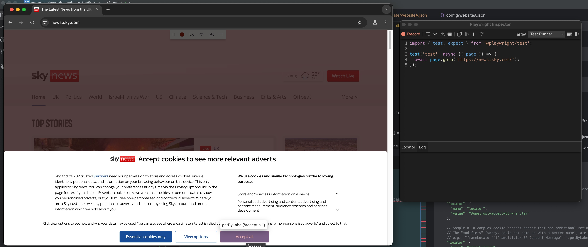
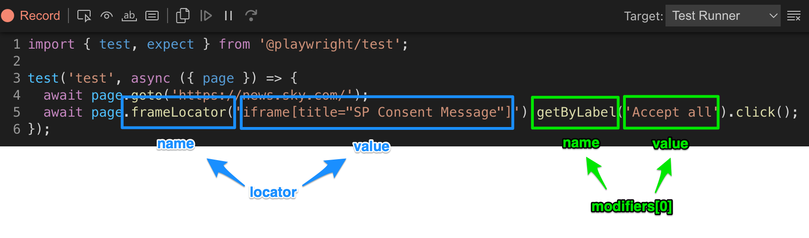

# Generic Playwright Website Testing
Generic approach to run high-level Playwright website tests, based on simple JSON configurations.
Functionality comprises of
* consent banner acceptance
* data layer checks
* request validation (GET and POST including payload check with partial matching)

## Why this repository?
While Playwright is a powerful tool to run end-to-end tests on websites, it can be quite complex to set up and maintain tests.
On top of that, websites often have consent banners that need to be accepted before the tests can be run.
And from a data quality perspective, it is important to validate that both the data layer is correctly implemented and that the requests are sent correctly.

Compared to other tools like Puppeteer (Google's headless browser automation tool), Playwright has a couple of advantages:
* It supports all major browsers (Chromium, Firefox, WebKit) and can run tests in parallel. Fair enough, this repo is using Chromium only.
* It makes it way easier to interact with the website without relying on error-prone CSS selectors and instead is using accessibility selectors a.k.a. "locators", which do not change as frequently.
* It comes with awesome tools that make it easy to identify the aforementioned locators
* It comes with shadow DOM piercing capabilities, meaning no fiddling around with the shadow DOM to interact with elements

This repository contains a configuration-based generic Playwright test setup that can be used to run high-level tests on websites.
The tests are based on simple JSON configuration files that define the test cases. The tests are written in TypeScript and use Playwright to interact with the website.
However, you do not need to be a Playwright expert to use this setup. You can simply define the test cases in the JSON configuration files and run the tests.

## Work in Progress
Note that this is work in progress and will be extended over time (same as the documentation).
It has been built based on the needs of a specific project and is intended to be a generic starting point for other website tests.

## Folder Structure
```
tests/
├── src/
│   ├── types/
│   │   ├── RequestSpy.ts
│   │   ├── IfcConsentConfiguration.ts
│   │   ├── ...
│   ├── lib.ts
├── tests/
│   ├── config/
│   │   ├── websiteA.json
│   │   ├── ...
│   ├── generic_test.spec.ts
├── playwright.config.ts
├── tsconfig.json
```

### Key Files
* `src/lib.ts` - Contains the library functions that are used in the test files.
* `tests/config/` - Contains the JSON configuration files for the tests.
* `tests/generic_test.spec.ts` - Contains the generic test that reads the configuration files and runs the tests.
* `playwright.config.ts` - General Playwright test configuration.

## Getting Started
* to get started
  * clone the repository
  * install the dependencies
  * install the browser of your choice
  * look at the sample tests in the `tests/config/` folder
  * make it your own

### Installation
Install the dependencies:
```bash
npm install
```

Install the browser of your choice, e.g. Chromium:
```bash
npx playwright install --with-deps chromium
```

Run the tests:
```bash
npx playwright test
```

## Configuration
The tests are based on JSON configuration files that define the test cases. Each configuration file can contain multiple test cases.
The configuration files are located in the `tests/config/` folder.

A typical configuration file is listed below: (note that the JS-style inline comments are just for explanation and not valid JSON)

```json
{
  "name": "Test Name",
  "url": "https://www.example.com",
  "consent": {
    // The locator for the consent banner's accept button. This is different from consent banner to consent banner and can be simple to complex.
    
    // Sample A: OneTrust CookiePro banner
    "locator": {
      "name": "locator",
      "value": "#onetrust-accept-btn-handler"
    },
    
    // Sample B: a complex cookie consent banner that has additional refinements to the initial locator.
    // The "modifiers" (sorry, could not come up with a better name), are essentially function names and string parameters to the locator.
    // e.g., "frameLocator('iframe[title="SP Consent Message"]').getByLabel('Accept all')" can be set up as follows
    "locator": {
      "name": "frameLocator",
      "value": "iframe[title='SP Consent Message']"
    },
    // where the locator is a combination of locators. In that case, you may provide an array of "modifiers" (sorry, could not come up with a better name) that will be applied to fine tune the locator
    "modifiers": [
      {
        "name": "getByLabel",
        "value": "Accept all"
      }
    ]
  },
  "tests": [
    {
      "name": "My Website Test",
      // once loaded, inspect the page for the existence of a specific data layer with a given payload
      "dataLayer": {
        // name of the data layer i.e. what you would see under window.<dataLayer name>
        "name": "dataLayer",
        "payload": {
          "key": "value",
          "key2": "value2"
        }
      },
      // Check for specific expected requests on the website.
      // These can for instance be your tag manager library, marketing pixels, tracking libraries, etc.
      // Include what you expect to see on your website, AFTER the user has accepted the consent banner.
      "requests": [
        {
          // Adobe Launch library
          "url": "/launch"
        },
        {
          // Check for a specific request URL pattern. This can include parts of the URL or a full URL.
          "url": "https://www.somedomain.com/some/other/url",
          // Check for specific parts of the request payload i.e., you do not need to
          // provide the entire payload, just what's relevant
          // The payload is a JSON-object that will be checked for partial matches,
          // irrelevant from whether it is a GET or POST request
          "payload": {
            "key": "value"
          }
        },
        {
          // some Adobe Analytics call
          "url": "/b/ss",
          // check for specific sub-parts in the request payload.
          // i.e., you do not need to check the entire payload, just what's relevant
          "payload": {
            "events": "event1",
            "eVar1": "value",
            "eVar2": "value2",
            "prop1": "value"
          }
        }
      ]
    }
  ]
}
```

For the cookie _**consent**_ locator, you can run `npx playwright codegen` or `npm run codegen` to open a browser window where you can click on the "accept" button
and Playwright will generate the locator for you.


<br/><br/>
